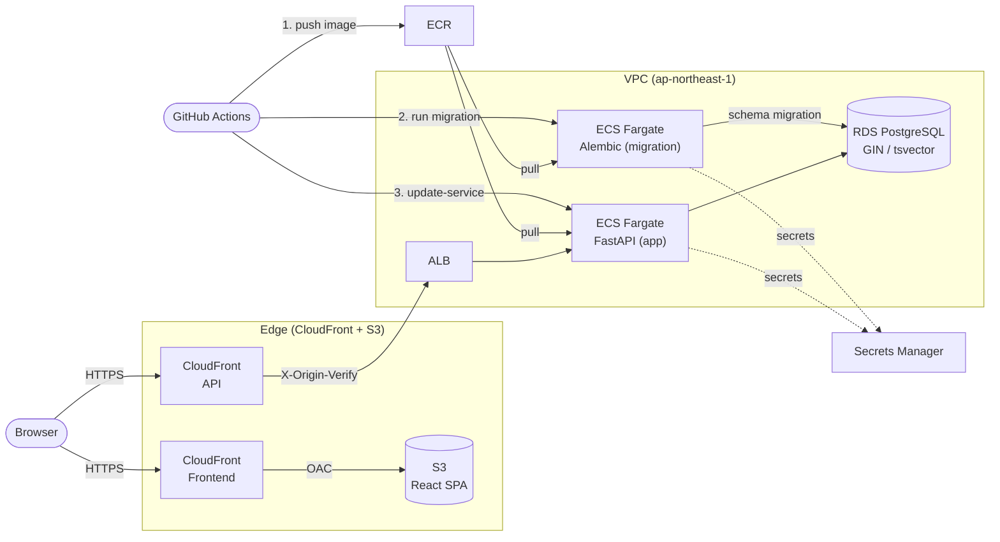

# SaaS Task Manager on ECS

A production-ready, secure, and scalable multi-tenant SaaS task management system built on AWS ECS Fargate — a minimal Linear/Asana clone.
All infrastructure layers are managed with Terraform, and continuous delivery is achieved through GitHub Actions.

## Architecture



| Layer | Technology |
|---|---|
| Frontend | React (Vite) + S3 + CloudFront (OAC) |
| Backend | FastAPI (Python 3.12) on ECS Fargate |
| Database | Amazon RDS for PostgreSQL (Private Subnet) |
| Migrations | Alembic (run as a one-off ECS task on each deploy) |
| Networking | VPC, ALB, Route53, ACM |
| Security | ECS Task IAM roles, ACM (TLS 1.2+), AWS Secrets Manager, custom origin header |
| IaC | Terraform (fully modular) |
| CI/CD | GitHub Actions (OIDC — no stored AWS credentials) |

---

## Application Features

**Multi-tenant SaaS** — every resource is scoped to an Organization.

| Feature | Details |
|---|---|
| Organizations | Multi-tenant isolation; invite members by role |
| Projects | Group issues by project within an org |
| Issues | Full CRUD with status and priority tracking |
| Comments | Threaded comments per issue |
| Activity logs | Automatic audit trail on every change |
| Labels | Org-scoped labels attached to issues (many-to-many) |
| Assignees | Assign multiple org members to an issue (many-to-many) |
| Full-text search | `?q=` searches title + description (tsvector/GIN on PostgreSQL) |
| Filters & sort | `?status=`, `?priority=`, `?assignee_id=`, `?label_id=`, `?sort=` |
| Cursor pagination | Stable keyset pagination via `next_cursor` |

**RBAC** — role-based access control per organization.

| Role | Create/Update | Delete | Manage labels/assignees |
|---|---|---|---|
| member | No | No | No |
| admin | Yes | No | Yes |
| owner | Yes | Yes | Yes |

---

## Architecture Decision Records

### ADR 1 — Database Migrations as ECS One-off Tasks (Ordered Before Service Update)

**Context**

Running Alembic migrations inside the application container at startup is a common pattern, but it creates race conditions when multiple tasks start simultaneously — each task attempts the migration independently, leading to conflicts or duplicate operations. Alternatively, migrations can run in the CI pipeline using a database connection string, but this requires exposing the RDS endpoint outside the VPC.

**Decision**

Run Alembic as a standalone ECS Fargate one-off task. The CI/CD pipeline is structured in three ordered steps:

1. Build and push the Docker image to ECR (`:$GITHUB_SHA`)
2. Launch an ECS one-off task using the same image with `alembic upgrade head` as the command — **wait for exit 0**
3. Only if the migration succeeds, run `ecs update-service` to roll out the new application version

This guarantees the schema is fully up to date before any application pod starts serving traffic.

**Trade-offs accepted**

- Each deployment runs an extra ECS task (~30–60 seconds). This is acceptable for the safety guarantee it provides.
- If the migration fails, the pipeline halts before updating the service — the old application version continues serving against the old schema, which remains valid.

---

### ADR 2 — Cursor-Based Pagination over Offset Pagination

**Context**

The issues list endpoint must support pagination across potentially large result sets. Offset-based pagination (`LIMIT 20 OFFSET 100`) is simple but unstable: if a row is inserted or deleted between page fetches, items can be skipped or duplicated.

**Decision**

Use keyset (cursor) pagination. The response includes a `next_cursor` value encoding the last item's sort key. The next request passes `?cursor=<value>` to fetch the next page starting after that item.

The cursor is stable regardless of concurrent writes, and the query uses the primary key index — making it O(log n) rather than O(n) for deep pages.

**Trade-offs accepted**

- Cursor pagination does not support random page jumps (e.g., "go to page 5"). For a task management application where users scroll through a list, this is an acceptable constraint.

---

### ADR 3 — PostgreSQL Full-Text Search (tsvector + GIN Index)

**Context**

The issues list requires a `?q=` search parameter that searches across issue titles and descriptions. Application-level `ILIKE '%keyword%'` is simple but performs a full table scan and does not scale.

**Decision**

Use PostgreSQL's native full-text search. A `tsvector` column is maintained on the `issues` table with a GIN index, combining the `title` and `description` fields. The search query uses `to_tsquery`, which leverages the index for O(log n) lookups.

**Trade-offs accepted**

- PostgreSQL full-text search uses language-specific stemming and stop words, which can produce unexpected matches or misses compared to simple substring search. For a task manager operating primarily in English, this behavior is acceptable.
- Requires an Alembic migration to add the `tsvector` column and GIN index.

---

### ADR 4 — Multi-Tenant Isolation at the Database Row Level

**Context**

In a multi-tenant SaaS application, tenant data must be strictly isolated. Two common approaches are: (1) a separate database or schema per tenant, or (2) a shared schema with an `organization_id` foreign key on every table.

**Decision**

Use a shared schema with `organization_id` on every resource table. All API endpoints are scoped under `/orgs/{org_id}/...`, and every query filters on `organization_id`. The RBAC middleware verifies the requesting user's membership in the target organization before any handler runs.

**Trade-offs accepted**

- A bug in the query layer could theoretically expose one tenant's data to another. This risk is mitigated by the RBAC middleware (which rejects requests before the query runs) and by unit tests that explicitly verify cross-tenant access returns `403 Forbidden`.
- Separate-schema isolation would be stronger but significantly more complex to operate at this scale.

---

## Repository Structure

```
.
├── terraform/
│   ├── bootstrap/          # S3 backend, DynamoDB lock table, Route53 hosted zone
│   ├── envs/dev/           # Environment entrypoint (main.tf, variables.tf, outputs.tf)
│   └── modules/            # Reusable modules
│       ├── nw/             # VPC, subnets, security groups, ALB
│       ├── ecs/            # ECS cluster, Fargate service, task definition, CloudWatch
│       ├── rds/            # RDS PostgreSQL
│       ├── ecr/            # ECR repository
│       ├── cloudfront/     # CloudFront distribution for API
│       ├── frontend/       # S3 bucket + CloudFront OAC for React
│       ├── lambda/         # Lambda function (CloudFront origin updater)
│       └── iam_oidc/       # GitHub Actions OIDC IAM role
├── app/                    # FastAPI backend (Python 3.12)
│   ├── routers/            # Auth, Organizations, Projects, Issues, Labels
│   ├── services/           # Business logic
│   ├── models/             # SQLAlchemy ORM models
│   ├── schemas/            # Pydantic request/response schemas
│   ├── core/config.py      # Settings (pydantic-settings)
│   ├── Dockerfile          # Multi-stage build
│   └── tests/              # pytest test suite
├── frontend/               # React (Vite) frontend
├── migrations/             # Alembic migration scripts
├── lambda/                 # Lambda function source (CloudFront origin updater)
├── .github/workflows/
│   ├── backend-deploy.yml  # Test → Build → Push ECR → Migrate → Deploy ECS
│   └── frontend-deploy.yml # Build → S3 sync → CloudFront invalidation
├── setup-all.sh            # Automated full infrastructure setup script
└── destroy-all.sh          # Safe full teardown script
```

---

## CI/CD Pipeline

### Backend (`app/**`, `migrations/**` push to `main`)

```
Push to main
    │
    ▼
[test]  pytest (Python 3.12)
    │
    ▼ (on success)
[deploy]
    ├── Configure AWS (OIDC)
    ├── docker build & push → ECR (tagged with git SHA + latest)
    ├── Run Alembic migrations (ECS one-off task, waits for exit 0)
    └── aws ecs update-service --force-new-deployment
```

### Frontend (`frontend/**` push to `main`)

```
Push to main
    │
    ▼
[deploy]
    ├── npm ci & build (Vite)
    ├── Configure AWS (OIDC)
    ├── aws s3 sync → S3
    └── CloudFront cache invalidation
```

---

## Security Highlights

| Concern | Implementation |
|---|---|
| No stored AWS credentials | GitHub Actions OIDC → IAM role assumption |
| Secret management | AWS Secrets Manager (injected as env vars into ECS tasks) |
| ALB direct-access bypass | `X-Origin-Verify` custom header validated in FastAPI middleware |
| TLS everywhere | ACM certificates, CloudFront enforces HTTPS redirect, TLS 1.2+ minimum |
| Private database | RDS in private subnets, no public endpoint |
| Container isolation | ECS Fargate — no shared host, no node-level instance profile access |

---

## Testing

86 tests across 7 test modules, all running with FastAPI's `TestClient` and an in-memory SQLite database — no running PostgreSQL, ECS cluster, or AWS account required.

```bash
cd app
python -m venv .venv && source .venv/bin/activate
pip install -r requirements-dev.txt
pytest tests/ -v
```

| Module | Cases | What it covers |
|---|---|---|
| `test_auth.py` | 7 | Register (success, duplicate, invalid format), login (success, wrong password, unknown user), health check |
| `test_organizations.py` | 17 | Create, list, get, update, delete; invite members; role assignment; outsider access (403) |
| `test_projects.py` | 13 | Full CRUD; org-scoped isolation; member/admin/owner permission boundaries |
| `test_issues.py` | 13 | Create/list/get/update/delete per role; RBAC boundaries (member cannot create, admin cannot delete) |
| `test_issue_filters.py` | 13 | Filter by status/priority/assignee/label; full-text search (`?q=`); cursor pagination; combined filter + search |
| `test_labels.py` | 15 | Label CRUD; attach/detach labels to issues; org-scoped isolation |
| `test_comments.py` | 8 | Add/list/delete comments; non-member access (403) |

The RBAC suite (`test_issues.py`) verifies that each role (member, admin, owner) can only perform the operations it is authorized for — including cases where an admin intentionally receives `403 Forbidden` on delete.

The cursor pagination tests (`test_issue_filters.py`) confirm that pages are non-overlapping and that `next_cursor` becomes `None` on the final page.

---

## Estimated Monthly Cost (ap-northeast-1)

| Service | Spec | Cost |
|---|---|---|
| ECS Fargate | 0.5 vCPU / 1 GB × 1 task / 24h | ~$15/month |
| ALB | 1 load balancer | ~$16/month |
| RDS PostgreSQL | db.t3.micro / 20 GB | ~$22/month |
| CloudFront | 2 distributions | ~$1/month |
| Route 53 | 1 hosted zone | $0.50/month |
| Secrets Manager | 2 secrets (DB + App) | $0.80/month |
| ECR | Image storage (lifecycle managed) | ~$0.50/month |
| S3 | Static assets | ~$0.50/month |
| CloudWatch + Lambda | Logs, alarms, origin updater | ~$2/month |
| **Total** | | **~$58/month** |

---

## Deploy Guide

### Prerequisites
- AWS CLI configured with a profile named `dev-infra-01`
- Terraform >= 1.9

### Automated Setup (Recommended)

Use the setup script to provision all infrastructure in the correct order:

```bash
# 1. Copy and fill in your Terraform variables
cp terraform/bootstrap/terraform.tfvars.example terraform/bootstrap/terraform.tfvars
cp terraform/envs/dev/terraform.tfvars.example terraform/envs/dev/terraform.tfvars

# 2. Run the setup script
./setup-all.sh
```

The script performs the following steps automatically:
1. Checks that all required tools are installed (`terraform`, `aws`)
2. Deploys the bootstrap layer (S3 state backend, DynamoDB lock table, Route53 hosted zone)
3. Displays the Route53 name servers and pauses — register these at your domain registrar before continuing
4. Runs `terraform apply` to provision VPC, ECS, RDS, ECR, Lambda, and CloudFront
5. Prints all values needed for GitHub Actions Secrets and the access URLs

> **Note:** The script stops immediately on any error and displays a failure message. If it fails mid-way, check the AWS console for any partially created resources before re-running.

### Manual Setup

<details>
<summary>Click to expand manual steps</summary>

#### Step 1 — Bootstrap (S3 state backend + Route53)
```bash
cd terraform/bootstrap
cp terraform.tfvars.example terraform.tfvars  # fill in your values
terraform init && terraform apply
```

After applying, register the displayed Route53 name servers at your domain registrar.

#### Step 2 — Core Infrastructure (ECS, RDS, CloudFront)
```bash
cd terraform/envs/dev
cp terraform.tfvars.example terraform.tfvars  # fill in your values
terraform init
terraform apply
```

</details>

### Step 3 — CI/CD Secrets (GitHub Actions)

Set the following repository secrets in GitHub:

| Secret | Description |
|---|---|
| `AWS_ROLE_ARN` | IAM role ARN output from `terraform output github_actions_role_arn` |
| `ECR_REPOSITORY` | ECR repository name |
| `ECS_CLUSTER` | ECS cluster name |
| `ECS_SERVICE` | ECS service name |
| `ECS_TASK_DEFINITION` | ECS task definition family name (for migration task) |
| `ECS_SUBNET_ID` | Public subnet ID (for migration run-task) |
| `ECS_SECURITY_GROUP_ID` | ECS tasks security group ID |
| `S3_BUCKET_NAME` | Frontend S3 bucket name |
| `CLOUDFRONT_DISTRIBUTION_ID` | CloudFront distribution ID for the frontend |
| `VITE_API_URL` | Backend API URL (e.g. `https://api.example.com`) |

When using `setup-all.sh`, all of these values are printed automatically at the end of the script.

Push to `main` to trigger the pipeline.

---

## Teardown

```bash
./destroy-all.sh
```

The script performs teardown in the correct order to avoid dependency errors:
1. Scales down the ECS service to zero and stops all running tasks
2. Deletes all ECR images (required before Terraform can remove the repository)
3. Runs `terraform destroy` on the main infrastructure (`envs/dev`)
4. Cleans up Route53 records added by ECS/ALB, then destroys the bootstrap layer

> **Note:** The script stops immediately on any error and displays a failure message, so a successful "All resources have been successfully deleted." message confirms full teardown.
>
> **If the script fails mid-way** (some resources deleted, some remaining), simply re-run `./destroy-all.sh`. Terraform reads the state file to determine what still exists and will only attempt to destroy the remaining resources — it is safe to re-run.

---

**Author:** Takayuki Kotani ([GitHub](https://github.com/kamotaka-0426))
